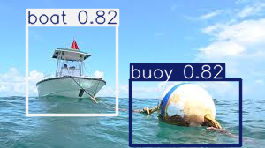
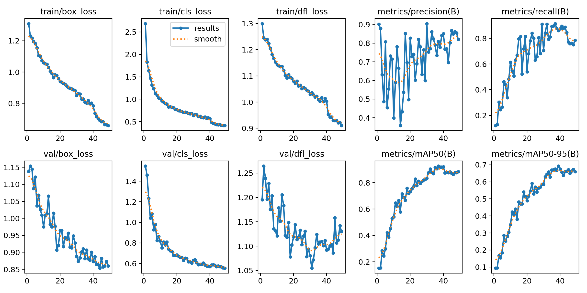
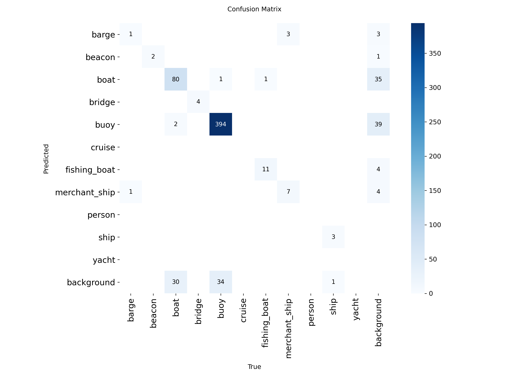

# Maritime Obstacle Detection : buoy and boats


## Overview
This project is an autonomous perception module designed to detect maritime obstacles (buoys and boats) in real-time.

The architecture is optimized for low-power deployment without a GPU:
1.  **Computer Vision** : Uses YOLOv8 Nano fine-tuned on a specific maritime dataset.
2.  **Inférence Optimisée** : Video pipeline via OpenCV with memory management using generators `(stream=True)` for long-term stability.
3.  **Conteneurisation** : Docker image optimized for CPU (< 1GB), separating the build and run environments.
4.  **Reproductibilité** : Full automation via `Makefile` and `API management`.



---

## Performance & Results

The model was trained for 50 epochs (due to limited computing resources) using a specific "Buoys & Boats" Dataset (via Roboflow).
[fichiers](https://universe.roboflow.com/clearwater/buoys-and-boats)

### 1. Training Metrics
The model achieves satisfactory accuracy (mAP) for a Nano model, guaranteeing fast inference (>30 FPS on standard CPUs).


*(Courbes de perte et de précision durant l'entraînement)*

### 2. Confusion Matrix
The model's ability to distinguish classes (Buoys vs. Boats) and ignore the background.



---

## Technical Architecture

The project follows a strict separation between R&D (Training) and Production (Inference).

| Module | Techno | Description |
| :--- | :--- | :--- |
| **Training** | `PyTorch` + `CUDA` | GPU/Cloud training. Requires an API key. Generates the `best.pt` file. |
| **Inférence** | `OpenCV` + `YOLO` | **Completely Offline**. Uses CPU only. No internet dependency.|

### Embedded Optimization (Solved Challenges)
* **Docker Image Reduction:** Reduced from 16GB (Standard) to ~3GB by forcing the installation of`torch-cpu`, `opencv-headless` and excluding build caches.
* **RAM Stability:** Use of Python generators for video processing, avoiding memory saturation on continuous streams.

---

## How to Run the Project

### Prerequisites

* Docker
* Python 3.11+
* Webcam (For real-time demo)

### Fast Inference (Local)

```bash
# 1. Install dependencies
make install

# 2. Run detection (Default: Webcam)
make run
```

### Containerized Deployment

```bash
# Build image + Run GUI container
make deploy
```

### Retrain the Model (R&D)

If you wish to reproduce the training (requires an API key):

Create a file .env at the root : API_KEY=your_key.

Run the training script :

```bash
# Build the image + Run the GUI container
python src/train.py
```
